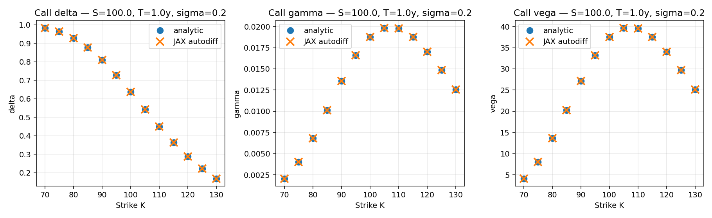
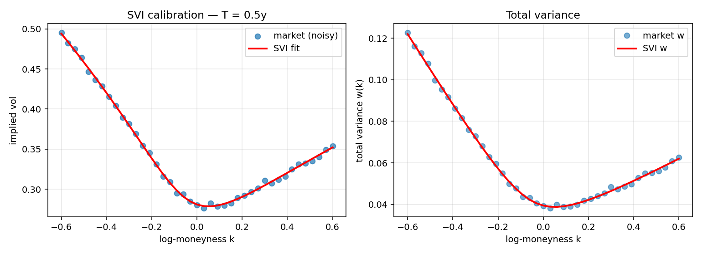
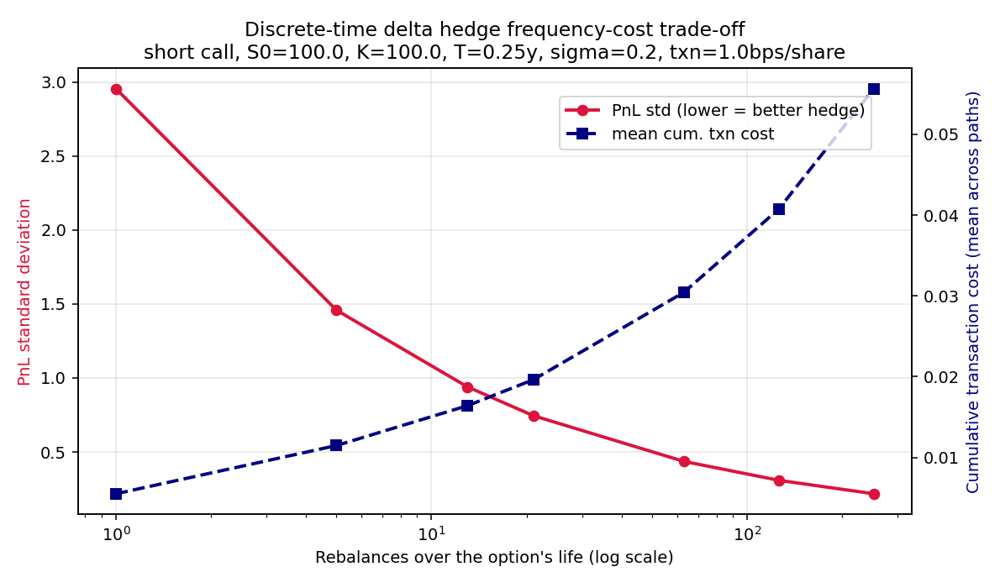

# JAX derivatives: Black-Scholes Greeks, SVI calibration, delta hedging

Self-contained JAX implementation of three building blocks of derivatives
quant work:

1. **Black-Scholes pricer with analytic Greeks**, alongside
   **JAX autodiff Greeks** built from the same one-line price function.
2. **SVI raw-parametrisation implied-variance surface calibration** via
   constrained L-BFGS-B (scipy) on the JAX loss.
3. **Discrete-time delta-hedging Monte Carlo simulator** quantifying the
   hedge-frequency against transaction-cost trade-off for a short-call book.

A companion to
[`crypto-momentum-backtest`](https://github.com/IsaacDodds/crypto-momentum-backtest).

---

## Results

### Greeks: analytic vs JAX autodiff
Same Black-Scholes price function, differentiated five ways. Across a strike
grid K ∈ [70, 130], spot S = 100, T = 1y, σ = 0.20, r = 0.05:

> **max |analytic − autodiff| = 6.75 × 10⁻¹⁴** (machine epsilon)



With autodiff the payoff is written once and every Greek of every order
follows from it. The closed-form Greeks are kept only as a check.

### SVI calibration
Synthetic smile generated from known parameters (a=0.02, b=0.12, ρ=−0.5,
m=−0.05, σ=0.18, T=0.5), perturbed with Gaussian noise of scale 1e−3 in
total variance, then refit.

> **MSE vs noiseless ground truth = 2.72 × 10⁻⁸**



Calibration solves a constrained non-linear least squares with the standard
arbitrage-prevention bounds:

```
b >= 0,  -1 < rho < 1,  sigma > 0
a + b * sigma * sqrt(1 - rho^2) >= 0   (non-negative-variance condition)
```

### Delta-hedge frequency-cost trade-off
Trader is short one ATM call (S₀ = 100, K = 100, T = 0.25y, σ = 0.20),
rebalances at fixed intervals to stay delta-neutral, pays 1 bp of share
notional per side. 5,000 GBM paths per frequency.

| n rebalances | PnL std | mean cumulative txn cost |
|---:|---:|---:|
| 1 | 2.95 | 0.006 |
| 5 | 1.46 | 0.012 |
| 13 | 0.94 | 0.016 |
| 21 | 0.75 | 0.020 |
| 63 (daily) | 0.44 | 0.030 |
| 126 (2× daily) | 0.31 | 0.041 |
| 252 (4× daily) | 0.22 | 0.056 |



The trade-off is the standard one: PnL std roughly halves each time rebalance
frequency quadruples, while mean cumulative transaction cost rises
sub-linearly. For this instrument at 1 bp cost the sweet spot is around
daily rebalancing. Beyond that the marginal hedge improvement is paid for
twice over in fees.

---

## Files

| file | what |
|---|---|
| `black_scholes.py` | BS pricer + analytic Greeks + JAX autodiff Greeks |
| `svi.py` | SVI raw parametrisation, calibration, implied-vol helper |
| `delta_hedge.py` | GBM path sim, discrete delta-hedge engine, freq sweep |
| `demo.py` | Runs all three, saves the three plots + `demo_metrics.json` |
| `requirements.txt` | jax, numpy, scipy, matplotlib |

---

## Reproduce

```bash
pip install jax numpy scipy matplotlib
python demo.py
```

Outputs all three PNGs and `demo_metrics.json` in the repo root.

---

## Why JAX

* The same price function gives the price and five Greeks via grad, jacfwd
  and jacrev, and the result matches closed form to machine epsilon.
* Trivial to scale: vmap across strikes and maturities, jit the hot path.
* Structured payoffs (basket, barrier, Asian) get Greeks for free once
  written; calibration losses get gradients for free.

---

## Author

Isaac Dodds, MSc Advanced Machine Learning, University of Bath.
